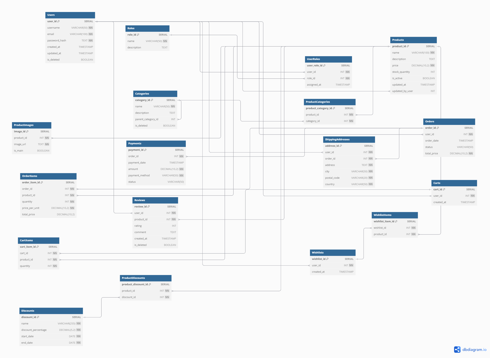

# Звіт по лабораторній роботі: Онлайн магазин

## Опис проекту

Цей проект реалізує базу даних для онлайн магазину з використанням PostgreSQL. Для ізоляції середовища та зручності розгортання використовується Docker. Усі необхідні таблиці, функції, процедури та тригери створюються за допомогою SQL скриптів при ініціалізації контейнера. Проект включає в себе створення бази даних, заповнення її тестовими даними, а також створення функціоналу для обробки знижок та продуктів.

## Технології

- **PostgreSQL** – реляційна база даних, використовувана для зберігання інформації про продукти, замовлення та знижки.
- **Docker** – для розгортання та ізоляції середовища.
- **SQL** – мова для створення таблиць, вставки даних, написання функцій і тригерів.

## Кроки розгортання

1. **Підготовка середовища**:
   - Встановити Docker та Docker Compose.
   - Завантажити або клонувати репозиторій з проектом.

2. **Запуск контейнера**:
   - Використовуйте команду `docker-compose up` для запуску контейнера PostgreSQL. Це автоматично створить базу даних і виконає всі необхідні SQL скрипти.

## Розроблена схема бази даних 
https://dbdiagram.io/d/bd_1-6731cfe9e9daa85aca02f086

## Пояснення таблиць

Users – користувач, який може здійснювати покупки, додавати продукти до кошика, залишати відгуки, а також здійснювати платіжні операції.

Roles – ролі користувачів, які визначають їхні права у системі, наприклад, "admin" (адміністратор), "user" (користувач).

UserRoles – таблиця, що визначає, які ролі призначені конкретному користувачеві. Це дозволяє управляти доступом до функцій на основі ролей.

Products – товари, які доступні для покупки користувачами. Це може бути будь-який товар з ціною, кількістю в наявності та іншими характеристиками.

ProductImages – зображення, що прив'язані до продуктів. Один продукт може мати кілька зображень, де одне з них є основним.

Categories – категорії товарів, що дозволяють групувати їх для зручності пошуку та фільтрації. Категорії можуть бути вкладеними, тобто одна категорія може мати підкатегорії.

ProductCategories – зв'язок між продуктами та категоріями. Один продукт може належати кільком категоріям.

Orders – таблиця замовлень, де зберігається інформація про замовлення користувачів, включаючи статус, загальну суму та дату оформлення.

OrderItems – продукти, які входять до складу конкретного замовлення. Для кожного товару вказується кількість та ціна.

Payments – інформація про платежі, здійснені користувачами для конкретних замовлень. Включає метод оплати, суму та статус платежу.

ShippingAddresses – таблиця адрес доставки замовлень. Містить адреси користувачів для відправлення товарів.

Carts – кошики користувачів, в яких зберігаються продукти до оформлення замовлення. Кожен користувач може мати один активний кошик.

CartItems – елементи кошика, де зазначено, які продукти та в якій кількості користувач додав до свого кошика.

Reviews – таблиця відгуків користувачів про продукти. Включає рейтинг, коментарі та дату залишення відгуку.

Wishlists – списки бажаних товарів, які зберігаються у користувачів. Це дозволяє користувачам зберігати продукти для подальшого перегляду або покупки.

WishlistItems – елементи в списку бажаних товарів. Включає продукти, які користувач додав у свій список бажаних товарів.

Discounts – таблиця знижок, що можуть бути застосовані до продуктів або категорій товарів. Включає відсоток знижки та діапазон дійсності.

ProductDiscounts – зв'язок між продуктами та знижками. Одна знижка може бути застосована до кількох продуктів, і навпаки.

## Опис функцій та процедур

### 1. `get_active_products`
- **Тип**: Функція
- **Опис**: Повертає список всіх активних продуктів (товарів), де `is_active = TRUE`. Функція повертає ідентифікатор продукту, назву, ціну та кількість на складі.
- **Параметри**: Немає
- **Результат**: Таблиця з ідентифікатором продукту, назвою, ціною та кількістю.

### 2. `get_user_order_count`
- **Тип**: Функція
- **Опис**: Повертає кількість замовлень, зроблених конкретним користувачем.
- **Параметри**:  
  - `user_id` (INT) – ідентифікатор користувача.
- **Результат**: Кількість замовлень (INT).

### 3. `restore_user`
- **Тип**: Функція
- **Опис**: Відновлює користувача, який був позначений як видалений (is_deleted = TRUE), змінюючи статус на FALSE.
- **Параметри**:  
  - `user_id` (INT) – ідентифікатор користувача.
- **Результат**: Не повертає значення (VOID).

### 4. `add_to_cart`
- **Тип**: Процедура
- **Опис**: Додає продукт до кошика користувача. Якщо продукт уже є в кошику, оновлює кількість, додаючи до існуючої. Якщо продукт відсутній, створює новий запис у кошику.
- **Параметри**:  
  - `user_id` (INT) – ідентифікатор користувача.
  - `product_id` (INT) – ідентифікатор продукту.
  - `quantity` (INT) – кількість продуктів, яку потрібно додати до кошика.
- **Результат**: Не повертає значення (VOID).

### 5. `complete_order`
- **Тип**: Процедура
- **Опис**: Завершує замовлення, змінюючи його статус на "Completed".
- **Параметри**:  
  - `order_id` (INT) – ідентифікатор замовлення.
- **Результат**: Не повертає значення (VOID).

### 6. `get_user_cart`
- **Тип**: Функція
- **Опис**: Повертає список товарів, які знаходяться в кошику користувача. Для кожного товару вказується його ідентифікатор, назва, кількість, ціна за одиницю та загальна вартість товару в кошику.
- **Параметри**:  
  - `user_id` (INT) – ідентифікатор користувача.
- **Результат**: Таблиця з інформацією про продукти в кошику (ідентифікатор продукту, назва, кількість, ціна за одиницю, загальна ціна).

## Опис тригерів

### 1. `update_product_timestamp`
- **Тип**: Тригер
- **Опис**: Цей тригер оновлює поле `updated_at` для продуктів, кожного разу коли оновлюється запис у таблиці `Products`. Поле `updated_at` встановлюється на поточний часовий штамп.
- **Подія**: `BEFORE UPDATE` на таблиці `Products`.
- **Функція**: 
  - При кожному оновленні запису в таблиці `Products` тригер викликає функцію `update_product_timestamp`, яка змінює поле `updated_at` на поточну дату та час.
  
### 2. `prevent_category_deletion`
- **Тип**: Тригер
- **Опис**: Цей тригер не дозволяє видаляти категорії, які містять принаймні один продукт у таблиці `ProductCategories`. Якщо категорія має продукти, які до неї прив'язані, буде викликана помилка.
- **Подія**: `BEFORE DELETE` на таблиці `Categories`.
- **Функція**: 
  - Функція `prevent_category_deletion` перевіряє наявність записів у таблиці `ProductCategories`, де вказана категорія, що видаляється. Якщо такі записи є, генерується помилка, що не дозволяє видалити категорію.

## Опис розрізів даних (Views)

### 1. `active_users`
- **Тип**: Розріз даних (View)
- **Опис**: Цей розріз даних вибирає активних користувачів (не видалених) з таблиці `Users`. Він повертає ідентифікатор користувача (`user_id`), ім'я користувача (`username`) та електронну пошту (`email`) для кожного користувача, у якого поле `is_deleted` має значення `FALSE`.  

### 2. `user_order_summary`
- **Тип**: Розріз даних (View)
- **Опис**: Цей розріз даних створює зведену інформацію про замовлення для кожного користувача. Він включає:
  - `user_id` – ідентифікатор користувача.
  - `username` – ім'я користувача.
  - `total_orders` – кількість замовлень, зроблених користувачем.
  
  Розріз працює за допомогою лівого з'єднання (LEFT JOIN) між таблицями `Users` та `Orders`, що дозволяє враховувати навіть користувачів, які не зробили жодного замовлення. Показуються лише користувачі, які не видалені з системи (`is_deleted = FALSE`).